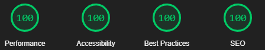
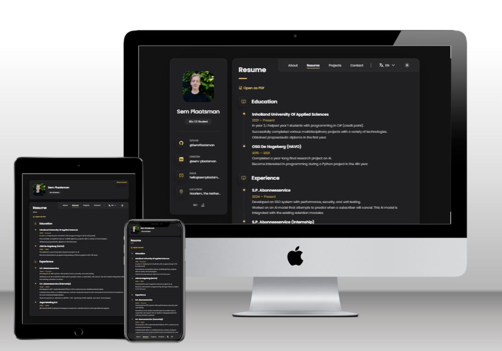
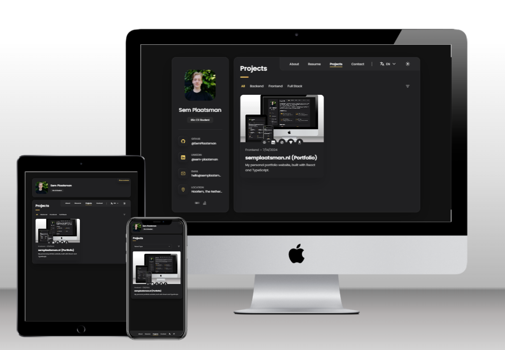
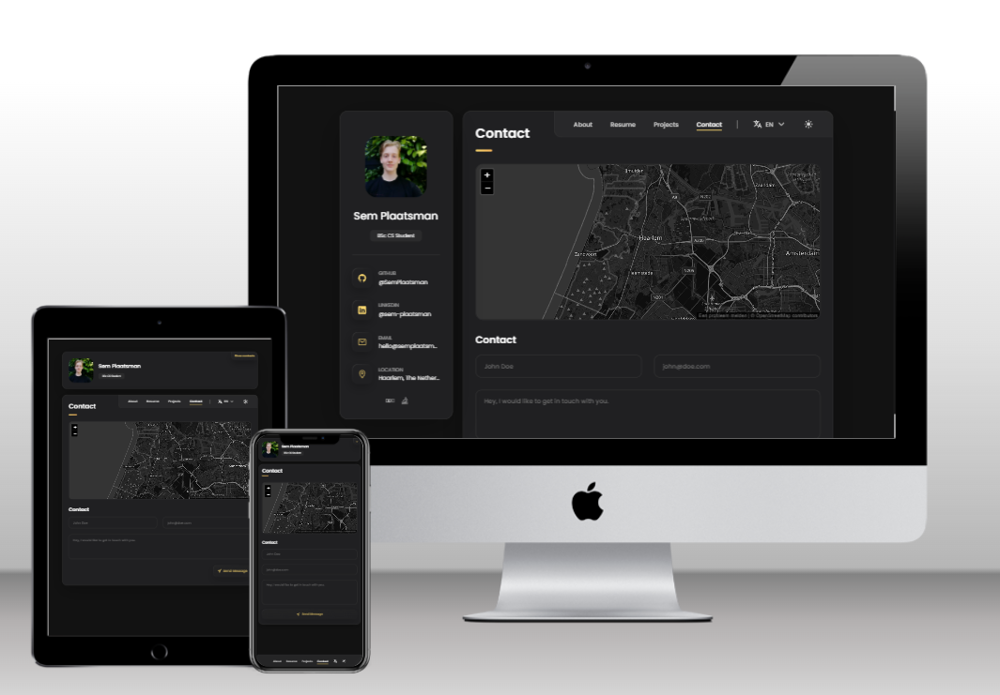
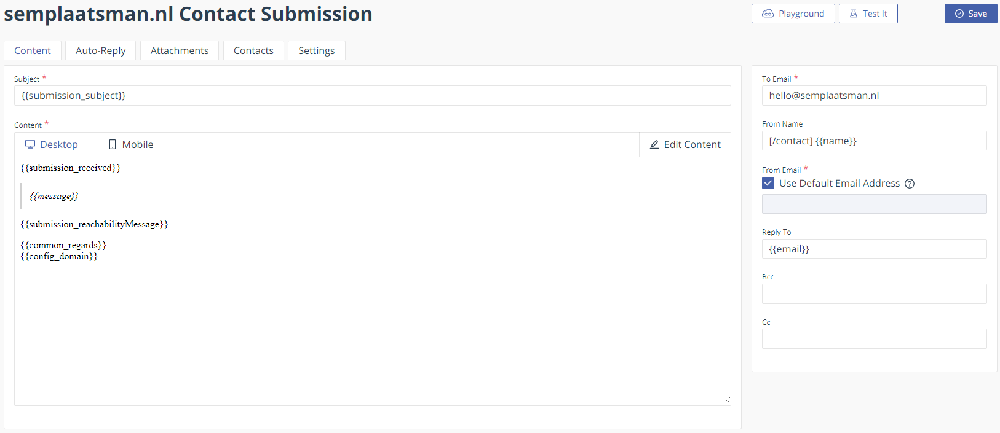
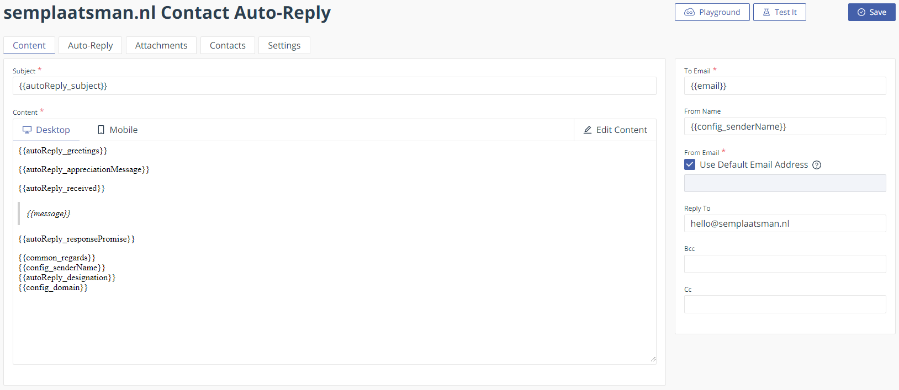

# semplaatsman.nl

Welcome to the repository for semplaatsman.nl! This project showcases a modern fully responsive
personal portfolio website built with React!


<center>
	
</center>

> 💡 The documentation for this project is still being worked on, so if you see any mistakes or
> missing pieces of information, be sure to let me know!

> 💡 This project draws significant inspiration from
> [codewithsadee/vcard-personal-portfolio](https://github.com/codewithsadee/vcard-personal-portfolio).
> A heartfelt thank you to the original authors for their outstanding work, which served as a
> foundation for this portfolio. If you're looking for an HTML/CSS/JS alternative, please checkout
> their repository! For a full list of acknowledgments, please see the
> [Acknowledgements](#acknowledgements) section.

## Table of Contents

- [Features and Tech Stack](#features-and-tech-stack)
- [Demo](#demo)
- [Installation](#installation)
- [Configuration and Customization](#configuration-and-customization)
- [Architecture](#architecture)
- [CI/CD](#cicd)
- [Contributing](#contributing)
- [Code of Conduct](#code-of-conduct)
- [License](#license)
- [Contact](#contact)
- [Acknowledgements](#acknowledgements)

## Features and Tech Stack

This repository combines modern web development technologies with efficient development practices.
Here's what makes this project stand out:

### Core Technologies

- [**React**](https://react.dev/): A powerful JavaScript library for building user interfaces
- [**Vite**](https://vitejs.dev/): Next-generation frontend tooling for faster and leaner
  development
- [**TypeScript**](https://www.typescriptlang.org/): Adds static typing to JavaScript, enhancing
  code quality and developer experience
- [**SCSS**](https://sass-lang.com/): A popular CSS preprocessor that extends CSS with features like
  variables, nested rules, and mixins
- [**reacti18next**](https://react.i18next.com/): An internationalization framework for React
  applications, enabling easy implementation of multi-language support
- [**React Router**](https://reactrouter.com/en/main): A standard routing library for React,
  enabling the creation of single-page applications with dynamic, client-side routing
- [**React Helmet**](https://www.npmjs.com/package/react-helmet): A reusable React component that
  manages changes to the document head, useful for setting page-specific metadata and other SEO
  concerns
- [**React Icons**](https://react-icons.github.io/react-icons/): A comprehensive library of popular
  icon packs as React components, providing easy integration of icons
- [**ESLint**](https://eslint.org/): A static code analysis tool for identifying problematic
  patterns in code, helping maintain code quality and consistency
- [**axe-core**](https://www.npmjs.com/package/axe-core): An accessibility testing engine for
  websites and applications, helping ensure accessibility for all users
- [**Prettier**](https://prettier.io/): An opinionated code formatter that supports multiple
  languages, ensuring consistent code style

### Key Features

- Fully responsive for all devices
- Hot Module Replacement (HMR) for quick feedback during development
- Fast loading times thanks to Vite's optimized build process
- Type-safe code with TypeScript, reducing runtime errors
- Component-based architecture for reusable and maintainable code
- Support for light and dark mode
- Built-in multilingual support with react-i18next
- Excellent Google Lighthouse performance
- Multilingual email integration (also obfuscates your personal email address)
- Free hosting through GitHub Pages

## Demo

<details>
<summary style="font-size: 1.17em; font-weight: bold; margin: 0.5em 0;">About</summary>

[](https://semplaatsman.nl/)

</details>

<details>
<summary style="font-size: 1.17em; font-weight: bold; margin: 0.5em 0;">Resume</summary>

[](https://semplaatsman.nl/resume)

</details>

<details>
<summary style="font-size: 1.17em; font-weight: bold; margin: 0.5em 0;">Projects</summary>

[](https://semplaatsman.nl/projects)

</details>

<details>
<summary style="font-size: 1.17em; font-weight: bold; margin: 0.5em 0;">Contact</summary>

[](https://semplaatsman.nl/contact)

</details>

Visit the live site: [semplaatsman.nl](https://semplaatsman.nl/)

## Prerequisites

Before you begin, ensure you have met the following requirements:

- You have installed the latest version of [Node.js](https://nodejs.org/en) and npm (comes with
  Node.js)
- You have a Windows/Linux/Mac machine with [Git](https://git-scm.com/downloads) installed
- You have read [CONTRIBUTING.md](./CONTRIBUTING.md) (optional, if you're looking to contribute)

## Installation

To get started with this project:

1. Clone the repository:

   ```bash
   git clone https://github.com/SemPlaatsman/semplaatsman.nl.git
   cd semplaatsman.nl
   ```

2. Install dependencies:

   ```bash
   npm install
   ```

3. Start the development server:

   ```bash
   npm run dev
   ```

4. Run linting with ESLint:

   ```bash
   npm run lint
   ```

5. Run automatic lint fixing with ESLint:

   ```bash
   npm run lint:fix
   ```

6. To build the application for production:
   ```bash
   npm run build
   ```

## Configuration and Customization

This section guides you through customizing the project for your own use:

1. Fork this repository to your GitHub account.

2. Update the following files with your information:

   - [`.github/workflows/main.yml`](./.github/workflows/main.yml): Update the workflow to add your
     own domain
   - [`public/CNAME`](./public/CNAME): Update the CNAME record to your own domain
   - [`public/robots.txt`](./public/robots.txt): Update the Robots.txt record
   - [`public/site.webmanifest`](./public/site.webmanifest): Update the webmanifest
   - [`public/sitemap.xml`](./public/sitemap.xml): Update the static sitemap
   - [`src/config`](./src/config/): Update the configuration variables
   - [`src/i18n/languages.ts`](./src/i18n/languages.ts): Update the needed languages
   - [`package.json`](./package.json): Change the name, description, and author
   - [`index.html`](./index.html): Update the meta tags

3. Customizing styles:

   - [`src/styles/_variables.css`](./src/styles/_variables.scss): Update SCSS variables

4. Customizing content:

   - [`public/locales`](./public/locales): Update the locale files to match your wanted content.
     > 💡 if you change the structure of the locale files, make sure this is reflected inside the
     > associated component(s). Most of the time this is done automatically

5. Setting up EmailJS and Mailgun:

   - Sign up for an [EmailJS](https://www.emailjs.com/) account
   - Sign up for a [Mailgun](https://www.mailgun.com/) account
   - Create a new EmailJS service connected to your Mailgun account
   - In your EmailJS dashboard, create a new email template. See [Email Templates](#email-templates)
     for my templates.
   - Copy your EmailJS User ID and Email Template ID
   - Setup
     [Cloudflare Email Routing](https://www.cloudflare.com/nl-nl/developer-platform/email-routing/)
     for redirections to your personal Gmail address
   - Update the [`.env`](./.env) file with your EmailJS credentials (see step 6)

6. Environment variables:

   - Copy [`.env.example`](./.env.example) to [`.env`](./.env) and update the values as needed

7. Hosting Setup: You have two main options for hosting your site:

   a) Custom Domain with Cloudflare (Recommended Setup):

   1. Purchase a domain from a registrar like [Namecheap](https://www.namecheap.com/).
   2. Set up a [Cloudflare](https://www.cloudflare.com/) account and add your site:
      - Log in to Cloudflare and click "Add a Site"
      - Enter your domain name and click "Add Site"
      - Select the Free plan and continue
   3. Update nameservers at your domain registrar:
      - Cloudflare will provide you with nameservers
      - Log in to your Namecheap account and go to your domain's settings
      - Replace the existing nameservers with the ones provided by Cloudflare
   4. Configure Cloudflare DNS:
      - In Cloudflare, go to the DNS section
      - Add the appropriate records from
        [Managing a custom domain for your GitHub Pages site](https://docs.github.com/en/pages/configuring-a-custom-domain-for-your-github-pages-site/managing-a-custom-domain-for-your-github-pages-site)
   5. Enable HTTPS in Cloudflare:
      - Go to the SSL/TLS section and set SSL/TLS encryption mode to "Full"
   6. Update your GitHub repository:
      - Ensure your custom domain is set in the CNAME file in the `public` directory
      - Update the GitHub Actions workflow file to deploy to your custom domain
      - In your repository settings, under "Pages", ensure your custom domain is set

   b) GitHub Pages URL: If you prefer to use the default GitHub Pages URL
   (username.github.io/repo-name):

   > 💡 Note: I haven't tested this approach yet

   - Remove or update the CNAME file in the [`public`](./public) directory
   - Update the `homepage` field in `package.json` to match your GitHub Pages URL
   - Modify the GitHub Actions workflow file to remove custom domain configuration
   - Update any absolute URLs in your code to be relative paths

   > 💡 Note: The current configuration is set up for a custom domain with Cloudflare. If you
   > successfully set up the site with a different configuration, please consider contributing
   > documentation of the process to help future users.

   Further Reading:

   - [GitHub Pages Documentation](https://docs.github.com/en/pages)
   - [Namecheap Domain Setup with Cloudflare](https://www.namecheap.com/support/knowledgebase/article.aspx/9607/2210/how-to-set-up-dns-records-for-your-domain-in-cloudflare-account/)

Remember to test your site thoroughly after making these changes to ensure everything works as
expected with your chosen hosting setup. DNS changes can take some time to propagate, so be patient
if your site doesn't work immediately after making changes.

## Architecture

<details>
<summary style="font-size: 1.3em; font-weight: 500; margin: 0.5em 0;">Folder Architecture</summary>

This project follows a
[colocated](https://medium.com/trabe/colocating-react-component-files-the-tools-you-need-c377a61382d3)
component-based architecture. The most noteable files are listed below:

```text
.github/
└── workflows
    └── main.yml    # GitHub Actions workflow (CI/CD Pipeline)

public/
├── fonts/          # Font files
├── locales/        # Internationalization locales
├── resume/         # Resume PDF files
└── CNAME           # CNAME record pointing to your custom URL

src/
├── assets/         # Assets that are not globally used
├── components/     # Components that are not page-specific
├── config/         # Configuration files and asset mappings
├── contexts/       # Context definitions
├── hooks/          # Custom hooks
├── i18n/           # Internationalization configuration files
├── pages/          # Top-level page-specific components
├── providers/      # Context providers
├── routes/         # Routing configurations
├── skeletons/      # Skeleton components
├── styles/         # Global SCSS styling
├── types/          # General/global types
├── utils/          # Utility functions and helper methods
├── App.tsx
└── main.tsx

.env.example        # Example environment variables
.eslintrc.cjs       # ESLint configuration
.prettierrc         # Prettier configuration
index.html          # Entry point, SEO values for static scrapers are defined here
package.json        # Packages
vite.config.ts      # Vite (build tool) configuration
```

Components (including page components) are
[colocated](https://medium.com/trabe/colocating-react-component-files-the-tools-you-need-c377a61382d3)
and thus structured in the following way:

```text
Component/
├── index.ts                  # Provides default export gateway; see below
├── Component.module.scss     # SCSS module with component-specific styling
└── Component.tsx             # Main component
```

> 💡 Note: index.ts provides a gateway to the default export of the `Component.tsx` component. Which
> makes the following syntax possible:

```ts
// Without index.ts
import Component from ./Component/Component

// With index.ts
import Component from ./Component
```

</details>

<details>
<summary style="font-size: 1.3em; font-weight: 500; margin: 0.5em 0;">Email Architecture</summary>

The chosen email architecture provides a way of fully obfuscating your personal email address
through an email address on your personal domain (in my case `hello@semplaatsman.nl`). This email
architecture provides 100 emails through your contact page a month (or 200 without Auto-Reply
Emails) for free, and 100 emails a day through your personal email inbox. Below is the diagram:


This process can be divided into **8 steps**:

1. Sender sends an email from your contact page.
2. Email is sent from your contact page to EmailJS servers.
3. EmailJS sends a submission email to your custom email address (in my case
   `hello@semplaatsman.nl`).
4. Cloudflare Email Routing routes the email to your personal inbox.
5. EmailJS sends an Auto-Reply email to your Mailgun service.
6. Mailgun sends an Auto-Reply email as your custom email address (`hello@semplaatsman.nl`) to the
   sender.
7. If you wish to get back to a message from the Sender, you can send an email as your custom email
   address (`hello@semplaatsman.nl`) from your personal inbox through Mailgun (See
   [this StackOverflow post](https://stackoverflow.com/a/21649085/18598382)).
8. Mailgun sends your email back to the Sender.

<details>
<summary style="font-size: 1.1em; font-weight: 500;">EmailJS Templates</summary>

To implement this email system, I've set up two email templates in EmailJS:

1. **Contact Submission Template**: This template is used when a user submits the contact form on
   the website. It sends a notification to the custom email address, which is redirected to your
   personal inbox.

   

   Key features:

   - Subject line uses the `{{submission_subject}}` variable, allowing for dynamic subjects based on
     the user's input.
   - The template includes placeholders for the sender's name, email, and message.
   - It uses variables like `{{submission_received}}` and `{{submission_reachabilityMessage}}`,
     which can be populated with language-specific content to support multiple languages.
   - Dynamically set configuration variables, denoted with the `config_` prefix, which are gathered
     from the [config.ts](./src/config/config.ts) file are used.

2. **Auto-Reply Template**: This template is used to send an automatic response to the user who
   submitted the contact form.

   

   Key features:

   - The recipient's email is dynamically set using the `{{email}}` variable.
   - It uses variables like `{{autoReply_greetings}}`, `{{autoReply_appreciationMessage}}`, and
     `{{autoReply_responsePromise}}` to support multiple languages.
   - Dynamically set configuration variables, denoted with the `config_` prefix, which are gathered
     from the [config.ts](./src/config/config.ts) file are used.
   - The sender's original message is included for reference.

Both templates make extensive use of variables (denoted by `{{ }}`) which allows for dynamic content
insertion and multi-language support. The actual content for these variables is defined in the
`email.json` locale files, where language-specific text can be populated based on the user's
language preference.

</details>

<details>
<summary style="font-size: 1.1em; font-weight: 500;">Multi-language Support</summary>

The email templates are designed to support multiple languages through the use of variables. The
[`useSendEmail`](./src/hooks/useSendEmail.ts) hook is responsible for populating these variables
with the appropriate language-specific content. This approach allows for seamless language switching
without needing to create separate templates for each supported language. This does come at the
disadvantage that styling becomes more cumbersome. This issue could be solved by using a triple
brace (`{{{my_html}}}`) instead of a double one in the templates, but this comes with security
issues so this approach was not taken. See:
[Can I send HTML from my code?](https://www.emailjs.com/docs/faq/can-i-send-html-from-my-code/).

</details>

<details>
<summary style="font-size: 1.1em; font-weight: 500;">Integration with Email Architecture</summary>

These templates fit into the email architecture as follows:

1. The Contact Submission Template is used in step 3 of the email flow, where EmailJS sends a
   submission email to your custom email address.
2. The Auto-Reply Template is used in step 5, where EmailJS sends an Auto-Reply email to the Mailgun
   service.

The use of EmailJS for both the submission notification and the auto-reply allows for a streamlined
process, with Cloudflare and Mailgun handling the routing and final delivery of emails.

For more details on the implementation of multi-language support and email sending logic, refer to
the [`useSendEmail`](./src/hooks/useSendEmail.ts) hook, `email.json` locale files, and
[`ContactForm`](./src/pages/Contact/ContactForm/ContactForm.tsx) component in the project's source
code.

</details>

</details>

<details>
<summary style="font-size: 1.3em; font-weight: 500; margin: 0.5em 0;">Hosting Architecture</summary>

This project uses a combination of GitHub Pages, Cloudflare, and Namecheap to host and serve the
website. The hosting process can be divided into several key components:

1. **GitHub Pages**: Hosts the actual website files and serves them.

   - The repository's `main` branch is set up to build it's code and push it to the `gh-pages`
     branch. This branch is then served to a custom domain.

2. **Namecheap**: Acts as the domain registrar.

   - The custom domain (e.g., semplaatsman.nl) is purchased and managed through Namecheap.

3. **Cloudflare**: Serves as a CDN, DNS manager, and provides additional features.
   - DNS Management: Cloudflare manages the DNS records, pointing the custom domain to GitHub Pages.
   - CDN: Caches the website content globally for faster access.
   - SSL: Provides free SSL certificate for HTTPS.

This architecture provides several benefits:

- Free hosting through GitHub Pages
- Global content delivery and improved performance via Cloudflare's CDN
- DDoS protection, and other security features from Cloudflare
- Easy SSL setup for HTTPS
- Simplified deployment process through GitHub Actions

For detailed setup instructions, refer to the
[Configuration and Customization](#configuration-and-customization) section of this README.

</details>

## CI/CD

This project uses GitHub Actions for Continuous Integration and Deployment:

- **Continuous Integration**: On every pull request to `main`, GitHub Actions runs linting, (in the
  future tests), and tries to successfully build the application to ensure code quality.
- **Continuous Deployment**: When changes are merged to the `main` branch, the application is
  automatically built and deployed to GitHub Pages.

You can find the workflow configuration in
[`.github/workflows/main.yml`](.github/workflows/main.yml).

## Contributing

We welcome contributions to this project! Please see our [Contributing Guidelines](CONTRIBUTING.md)
for more information on how to get started.

The `main` branch features the most recent deployed and stable code of this portfolio website, and
is hosted on [semplaatsman.nl](https://www.semplaatsman.nl).

The `development` branch is used for ongoing development work. All contributions should be merged
into development before being merged into main.

## Code of Conduct

Please read our [Code of Conduct](CODE_OF_CONDUCT.md) before contributing or engaging in our
community.

## License

This project is licensed under the MIT License - see the [LICENSE](LICENSE) file for details.

## Contact

Sem Plaatsman - [LinkedIn](https://www.linkedin.com/in/sem-plaatsman/) -
[dev@semplaatsman.nl](mailto:dev@semplaatsman.nl)

Project Link: [SemPlaatsman/semplaatsman.nl](https://github.com/SemPlaatsman/semplaatsman.nl)

## Acknowledgements

Mockups were generated through the
[Multi Device Website Mockup Generator](https://techsini.com/multi-mockup/index.php) from
[TechSini.com](https://techsini.com/).

This project is based on the work of [codewithsadee](https://github.com/codewithsadee). The
[original repository](https://github.com/codewithsadee/vcard-personal-portfolio) provided the
foundation and inspiration for this portfolio website. I express my gratitude for their excellent
work and for making it available under the [MIT license](https://opensource.org/license/mit).
